# OBD Voice Assist

OBD Voice Assist is an Android application developed using Kotlin and Jetpack Compose. The app connects to an ELM327-compatible OBD-II simulator through Bluetooth, reads live vehicle diagnostic data, displays vehicle parameters in a modern dashboard, and provides bilingual visual and voice-based warnings in English and German.

The project was developed as a functional prototype to demonstrate interaction between mobile software, Bluetooth communication, OBD-II vehicle data, real-time visualization, and voice alert generation.

---

## 1. Project Title

**OBD Voice Assist: Smart Vehicle Diagnostics with Bilingual Voice Alerts**

---

## 2. Short Description

OBD Voice Assist allows an Android smartphone to connect to an OBD-II simulator using Bluetooth. After connection, the app sends standard OBD-II PID commands to retrieve live vehicle data such as speed, RPM, coolant temperature, throttle position, engine load, fuel level, intake manifold pressure, intake air temperature, mass air flow, and ignition timing.

The app displays these values on a real-time dashboard. When vehicle values exceed predefined warning or critical thresholds, the app shows a visual alert and speaks a warning using Android Text-to-Speech. The app supports both English and German languages.

---

## 3. Technical Realisation

The prototype was implemented as an Android application using Kotlin and Jetpack Compose. It communicates with an ELM327-compatible OBD-II simulator through Bluetooth Classic RFCOMM communication.

The system performs the following technical steps:

1. Requests Bluetooth permissions from the Android device.
2. Lists paired Bluetooth devices.
3. Connects to the selected OBD-II simulator.
4. Initializes the ELM327 adapter using AT commands.
5. Sends OBD-II PID commands.
6. Receives raw hexadecimal OBD-II responses.
7. Parses the responses into readable vehicle values.
8. Displays live data on a dashboard.
9. Detects warning and critical vehicle conditions.
10. Provides visual and voice-based alerts.

---

## 4. Features

- Bluetooth connection with an ELM327-compatible OBD-II simulator
- Live vehicle data reading
- Modern dashboard built with Jetpack Compose
- Professional splash screen and app logo
- English and German language support
- Android Text-to-Speech voice alerts
- Real-time warning and critical alert system
- Speed monitoring
- RPM monitoring
- Coolant temperature monitoring
- Throttle position monitoring
- Engine load monitoring
- Fuel level monitoring
- Intake manifold pressure monitoring
- Intake air temperature monitoring
- Mass air flow monitoring
- Ignition timing monitoring
- Bluetooth setup screen
- Live dashboard screen
- Warning messages in English and German
- Tested with OBD Simulator-B-V1.5 / ELM327-compatible simulator

---

## 5. Technologies Used

- Kotlin
- Android Studio
- Jetpack Compose
- Material 3
- Android Bluetooth API
- Bluetooth Classic / RFCOMM
- ELM327 AT commands
- OBD-II PID commands
- Android Text-to-Speech
- Git
- GitLab / THD MyGit

---

## 6. Hardware Requirements

- Android smartphone
- OBD Simulator-B-V1.5 or ELM327-compatible Bluetooth OBD-II simulator
- Bluetooth connection enabled on the phone
- USB cable for installing and debugging the app from Android Studio

---

## 7. Software Requirements

- Android Studio
- Android SDK
- Kotlin
- Gradle
- Android device running Android 8.0 or newer recommended
- Bluetooth permission enabled on the Android device

---

## 8. Installation Steps

### Step 1: Clone the Repository

Open a terminal and run:

```bash
git clone https://mygit.th-deg.de/ss11619/obd-voice-assist.git
```

Then enter the project folder:

```bash
cd obd-voice-assist
```

### Step 2: Open the Project in Android Studio

Open Android Studio and select:

```text
File -> Open
```

Choose the cloned project folder:

```text
obd-voice-assist
```

Wait for Android Studio to finish loading the project.

### Step 3: Sync Gradle

If Android Studio does not sync automatically, click:

```text
Sync Now
```

or use:

```text
File -> Sync Project with Gradle Files
```

### Step 4: Connect an Android Device

A real Android phone is recommended because the app uses Bluetooth communication.

Enable Developer Options and USB Debugging on the Android phone:

```text
Settings -> About Phone -> Tap Build Number 7 times
Settings -> Developer Options -> USB Debugging ON
```

Connect the phone to the computer using a USB cable.

### Step 5: Build the Project

In Android Studio, run:

```text
Build -> Clean Project
Build -> Rebuild Project
```

The project should build successfully.

### Step 6: Run the App

Select the connected Android phone from the device list and click:

```text
Run
```

The app will be installed and launched on the phone.

---

## 9. How to Run the App

1. Open the app on the Android phone.
2. The professional splash screen appears.
3. Select the preferred language if needed.
4. Tap the setup/start button.
5. Allow Bluetooth permissions when requested.
6. Select the paired OBD simulator from the Bluetooth device list.
7. Wait for the app to connect and initialize the ELM327 simulator.
8. Tap **Start Live** to begin real-time data reading.
9. Open the dashboard to view live vehicle parameters.
10. Change values on the simulator to test dashboard updates and alerts.

---

## 10. How to Connect the OBD Simulator

### Step 1: Turn On the OBD Simulator

Power on the OBD Simulator-B-V1.5 or another ELM327-compatible Bluetooth OBD-II simulator.

### Step 2: Pair the Simulator with the Android Phone

On the Android phone, open:

```text
Settings -> Bluetooth
```

Search for nearby Bluetooth devices and pair with the simulator.

The simulator may appear with a name such as:

```text
OBD Error
ELM327
OBDII
OBD Simulator
```

If a PIN is requested, try:

```text
1234
```

or:

```text
0000
```

### Step 3: Open OBD Voice Assist

After pairing, open the app.

Tap the setup/start button and allow Bluetooth permissions.

The paired simulator should appear in the Bluetooth device list.

### Step 4: Connect to the Simulator

Tap the simulator device name.

The app initializes the ELM327 connection using commands such as:

```text
ATZ
ATE0
ATL0
ATH0
ATS1
ATSP0
```

After successful initialization, the app is ready to read live OBD-II data.

### Step 5: Start Live Reading

Tap:

```text
Start Live
```

The app will begin sending OBD-II PID commands and updating the dashboard.

---

## 11. OBD-II Commands Used

| Vehicle Parameter | OBD-II PID |
|---|---|
| Speed | 010D |
| RPM | 010C |
| Coolant Temperature | 0105 |
| Throttle Position | 0111 |
| Engine Load | 0104 |
| Fuel Level | 012F |
| Intake Manifold Pressure | 010B |
| Intake Air Temperature | 010F |
| Mass Air Flow | 0110 |
| Ignition Timing | 010E |

---

## 12. System Architecture

```text
Android App
    ↓
Bluetooth Manager
    ↓
ELM327-compatible OBD-II Simulator
    ↓
OBD-II PID Commands
    ↓
OBD Parser
    ↓
Live Dashboard
    ↓
Alert Manager
    ↓
Text-to-Speech Voice Alerts
```

---

## 13. Project Structure

```text
com.example.obdvoiceassist
│
├── MainActivity.kt
│
├── models
│   ├── BluetoothDeviceItem.kt
│   ├── ObdLiveData.kt
│   ├── VehicleAlert.kt
│   └── AppLanguage.kt
│
├── bluetooth
│   └── BluetoothObdManager.kt
│
├── obd
│   └── ObdParser.kt
│
├── alerts
│   └── AlertManager.kt
│
├── tts
│   └── VoiceAlertManager.kt
│
├── localization
│   └── AppStrings.kt
│
└── ui
    └── screens
        ├── SplashScreen.kt
        ├── WelcomeScreen.kt
        ├── BluetoothScreen.kt
        └── DashboardScreen.kt
```

---

## 14. Alert System

The app includes warning and critical alerts.

Warning alerts are used when a value is above or below a safe range but not yet critical.

Examples:

```text
Engine temperature is high.
You are driving too fast.
Fuel level is low.
```

Critical alerts are used when immediate attention is required.

Examples:

```text
Critical engine temperature. Please stop the vehicle.
Critical speed warning. Please slow down and stop the vehicle safely.
Critical fuel level. Please stop the vehicle safely or refuel immediately.
```

German alerts are also supported.

Examples:

```text
Kritische Motortemperatur. Bitte halten Sie das Fahrzeug an.
Sie fahren zu schnell.
Der Kraftstoffstand ist niedrig.
```

---

## 15. Screenshots

Screenshots are stored inside the following project folder:

```text
app/screenshots/
```

The screenshots are divided into English and German versions.

### Loading Screens

#### Loading Screen 1

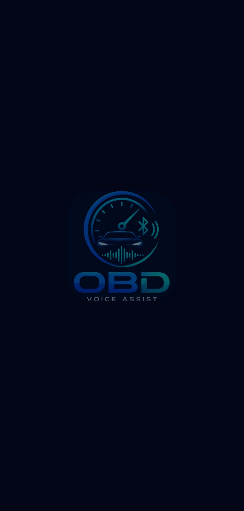

#### Loading Screen 2

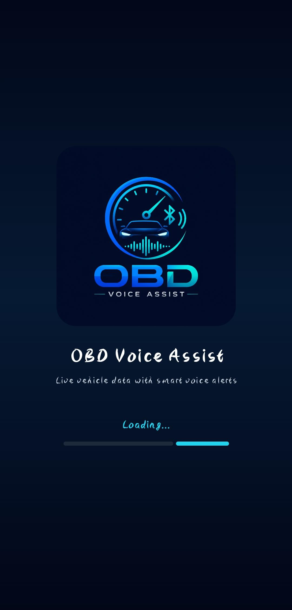

---

### English Version

#### English Main Screen

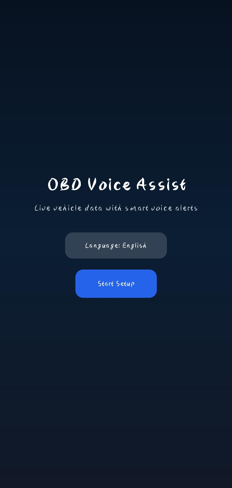

#### English Bluetooth Setup Screen

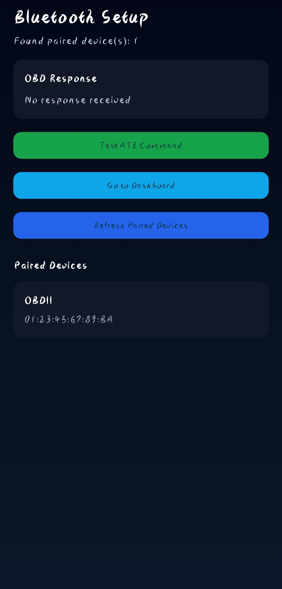

#### English Bluetooth Connection Unsuccessful Screen


#### English Dashboard

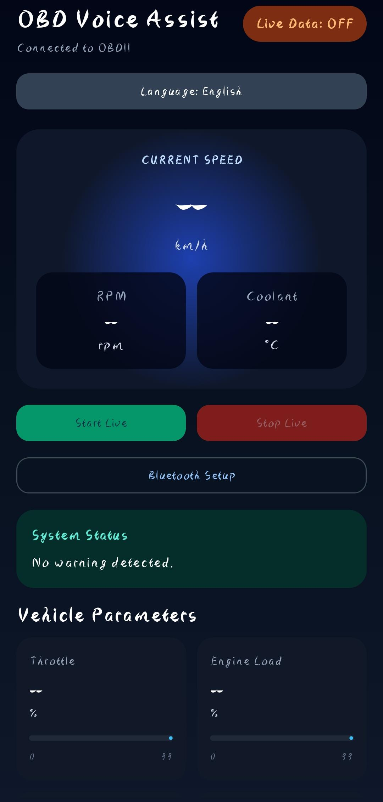

#### English Dashboard 2

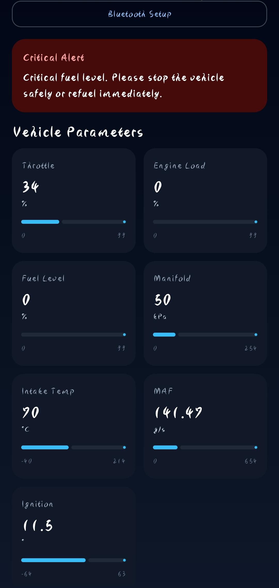

#### English Dashboard 3

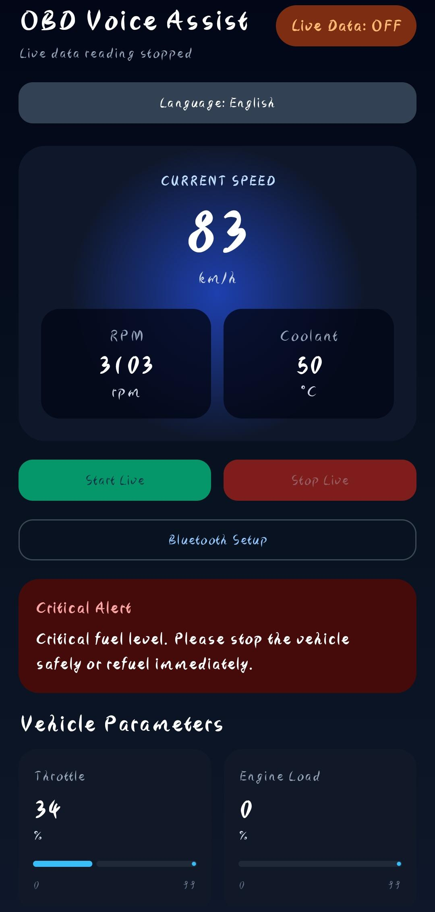

#### English Dashboard with Live Data

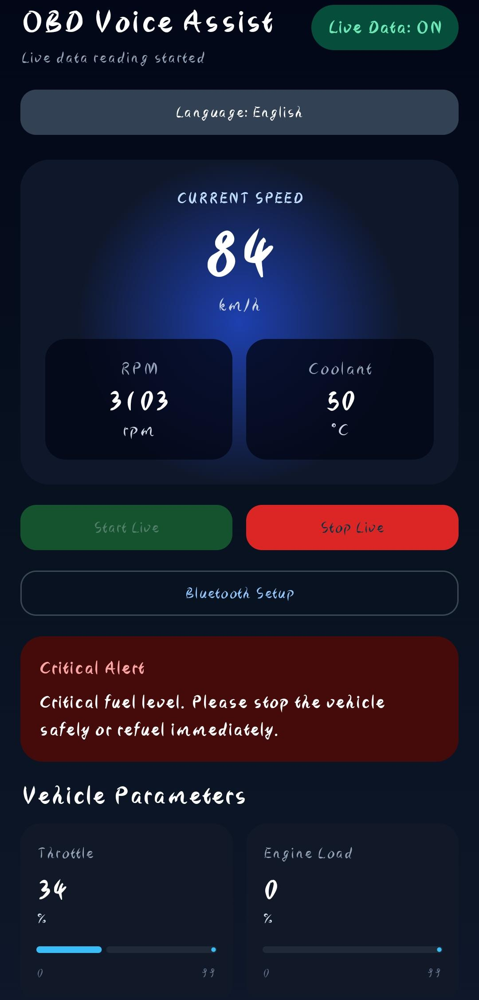

---

### German Version

#### German Main Screen

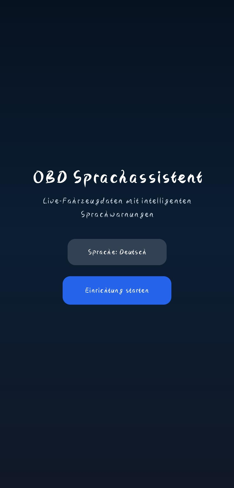

#### German Bluetooth Setup Screen

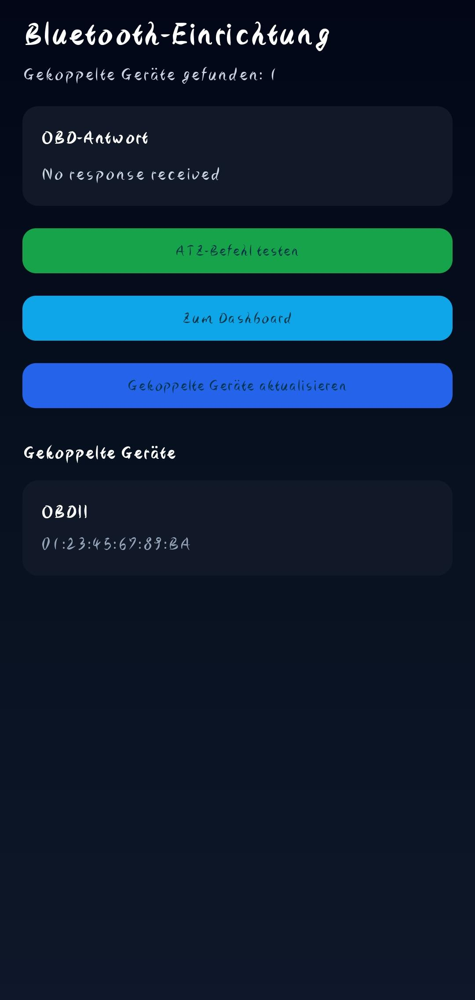

#### German Bluetooth Connection Unsuccessful Screen


#### German Dashboard

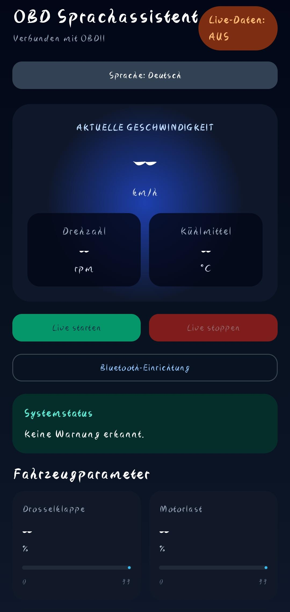

#### German Dashboard 2

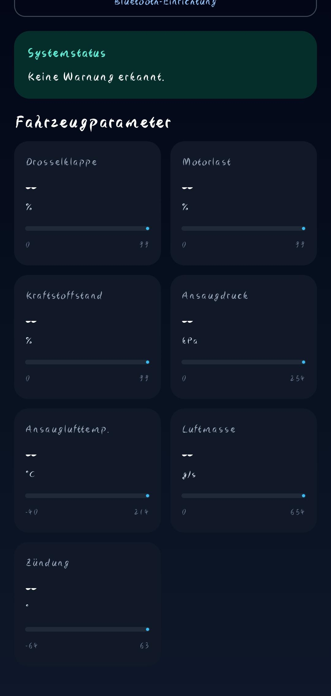

#### German Dashboard 3

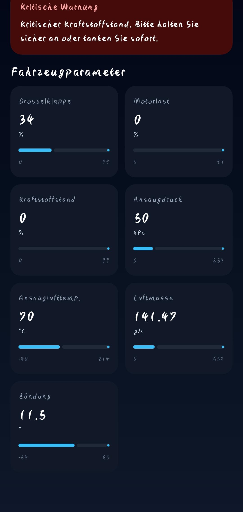

#### German Dashboard with Live Data

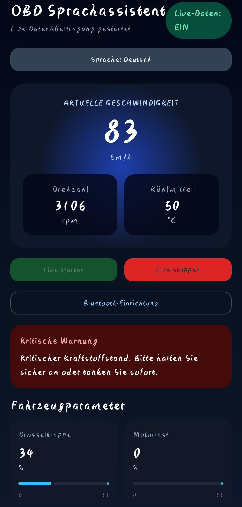

---

## 16. Evaluation

The prototype was evaluated using an OBD Simulator-B-V1.5 connected to an Android smartphone through Bluetooth.

The app was tested for Bluetooth connection, ELM327 initialization, OBD-II command communication, live data parsing, dashboard visualization, bilingual interface switching, and voice alert generation.

### Evaluation Table

| Test Case | Expected Result | Actual Result | Status |
|---|---|---|---|
| App starts | Splash screen appears | Splash screen displayed correctly | Passed |
| Bluetooth permission | App asks for permission | Permission dialog appears | Passed |
| Device listing | Paired OBD device appears | OBD simulator shown in list | Passed |
| OBD connection | App connects to simulator | Connection successful | Passed |
| ATZ command | ELM327 responds | ELM327 response received | Passed |
| Speed reading | Speed updates on dashboard | Speed displayed correctly | Passed |
| RPM reading | RPM updates on dashboard | RPM displayed correctly | Passed |
| Coolant reading | Coolant value updates | Coolant displayed correctly | Passed |
| Warning alert | Unsafe value triggers warning | Warning displayed | Passed |
| Voice alert | Warning is spoken | Text-to-Speech works | Passed |
| German mode | App switches language | German UI and alerts work | Passed |
| Stop live reading | Live data stops | Reading stops correctly | Passed |

### Evaluation Summary

The app successfully detected the paired OBD simulator, established an ELM327 Bluetooth connection, sent OBD-II PID commands, parsed responses, and displayed live vehicle parameters on the dashboard.

Warning and critical alerts were tested by changing simulator values such as speed, RPM, coolant temperature, and fuel level. The bilingual English/German interface and Android Text-to-Speech voice alerts were also tested successfully.

---

## 17. Known Limitations

- The prototype has mainly been tested with an OBD-II simulator.
- Real vehicle testing is still required.
- Some OBD-II values depend on simulator or vehicle support.
- Bluetooth connection can fail if another app is already connected to the OBD simulator.
- Only one app can connect to the Bluetooth OBD device at a time.
- Alert thresholds are currently predefined in the code.
- Diagnostic Trouble Code reading is not implemented yet.
- User preferences are not yet stored permanently.
- Auto-connect to the last used device is not yet implemented.
- Supported PID detection is not yet implemented.

---

## 18. Future Improvements

- Add a settings screen for custom alert thresholds
- Save language and voice settings using DataStore
- Add auto-connect to the last connected OBD device
- Add voice alerts ON/OFF setting
- Add alert history
- Add Diagnostic Trouble Code reading
- Add support for clearing DTC codes carefully
- Add demo mode without requiring a simulator
- Add real vehicle testing with different ELM327 adapters
- Add supported PID detection
- Improve connection stability handling
- Add exportable diagnostic reports

---

## 19. Conclusion

OBD Voice Assist demonstrates how an Android application can interact with vehicle diagnostic data through Bluetooth and an ELM327-compatible OBD-II interface. The prototype successfully combines hardware interaction, real-time data visualization, bilingual user interface design, and voice-based safety alerts.

The project shows the potential of mobile-based vehicle monitoring systems, especially for users who need immediate visual and spoken warnings while testing or monitoring vehicle parameters.

---

## 20. Author

Developed by:

```text
Syed Mubarak Shah
Deggendorf Institute of Technology
```

---

## 21. Repository

```text
https://github.com/syedmubarak821/OBDVoiceDriverAssistance/
```
